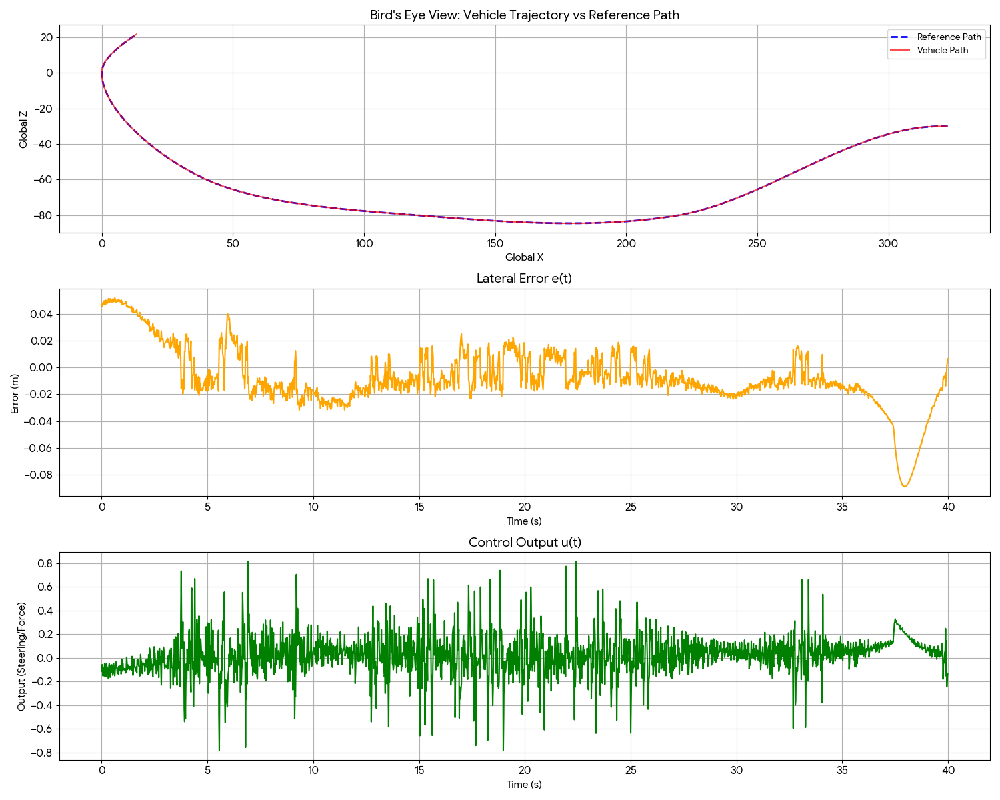

# 🚗 Unity PID Lane Tracker (AutoSteer)

**Ders:** Otomatik Kontrol  
**Proje Amacı:** Simülasyon ortamında (Unity) kinematik bir araç modeli kullanılarak, belirlenen virajlı bir referans yolun (şerit merkez çizgisi) **PID kontrolcü** yardımıyla otonom olarak takip edilmesidir.

---

## 📌 Proje Tanımı ve Hedefler

Bu projenin temel amacı, aracın yol üzerindeki şerit merkez çizgisine (referans yörünge) mümkün olduğunca yakın kalarak ilerlemesini sağlamaktır. Sistem; düzlükler, hafif virajlar ve keskin dönüşler barındıran kapalı bir parkur üzerinde test edilmektedir.

PID kontrolcü kullanılarak şerit merkezinden sapma (yanal hata) minimize edilir ve aracın yörüngede kalması sağlanır. Sistem, **P (Proportional), PI (Proportional-Integral) ve PID (Proportional-Integral-Derivative)** kontrolörlerinin ayrı ayrı test edilip analiz edilebilmesine olanak tanır.

### 📐 Sistem Değişkenleri
* **Referans Değer $r(t)$:** Şerit merkez hattı / hedef yörünge (Bu simülasyonda yanal referans daima $0$ alınmıştır).
* **Sistem Çıkışı $y(t)$:** Aracın şerit merkezine göre gerçek yanal konumu.
* **Hata $e(t)$:** Aracın şerit merkezinden olan yanal sapması.
  $$e(t) = r(t) - y(t)$$
* **Kontrol Çıkışı $u(t)$:** Aracın sağa veya sola yönelmesini sağlayan direksiyon açısı (kontrol girdisi).

---

## ⚙️ Uygulanan Özellikler

### 1. Gelişmiş Yol ve Araç Modeli
* Yol, **Catmull-Rom spline** algoritmaları ile matematiksel olarak üretilmiştir.
* Sadece düz yol değil; zikzaklar, keskin dönüşler ve S-virajlar içeren 8+ virajlı karmaşık bir pist oluşturulmuştur.
* Aracın fiziksel hareketi, **Kinematik Bisiklet Modeli (Kinematic Bicycle Model)** temel alınarak kodlanmıştır.

### 2. PID Kontrolcü Gerçeklenmesi
Kontrol algoritması, aşağıdaki PID denklemi eksiksiz olarak kodlanarak sisteme entegre edilmiştir:

$$u(t) = K_p e(t) + K_i \int_{0}^{t} e(t) dt + K_d \frac{de(t)}{dt}$$

* **Anti-Windup:** İntegral birikimini (integral windup) sınırlayan mekanizma eklenmiştir.
* **Alçak Geçiren Filtre (Low-Pass Filter):** Türevsel sıçramaları ve gürültüyü önlemek amacıyla sisteme dahil edilmiştir.

### 3. Gerçek Zamanlı UI ve Grafik Çizimi
* Ekranda kontrolcü çıkışı $u(t)$, yanal sapma $e(t)$ ve PID bileşenlerinin (P, I, D) canlı grafikleri izlenebilir.
* Kullanıcı, simülasyon çalışırken arayüz (UI) üzerinden anlık olarak $K_p$, $K_i$, $K_d$ parametrelerini ve araç hızını değiştirebilir; kontrolcü modunu (P, PI, PID) seçebilir.

### 4. Kapsamlı Veri Analizi
* Sistemdeki veriler, saniyede 50 kare (`FixedUpdate`) hassasiyetiyle analiz edilir.
* Simülasyon verileri (`Time`, `Lateral Error`, `Control Output`, vb.), UI üzerinde bulunan **"Export CSV"** butonu ile kolayca dışa aktarılıp raporlanabilir.

---

## 🚀 Kurulum ve Kullanım

1. Unity projesini açın *(URP - Universal Render Pipeline kullanılmaktadır)*.
2. `MainScene` isimli sahneyi açın.
3. **Play** tuşuna basarak simülasyonu başlatın.
4. **Sağ taraftaki UI Panelini kullanarak:**
   * **General:** Simülasyonu sıfırlayabilir, kameralar arası geçiş yapabilir ve verileri CSV formatında dışa aktarabilirsiniz.
   * **PID Tuning:** Anlık olarak $K_p$, $K_i$, $K_d$ değerlerini değiştirerek kontrolörün yörünge takibine etkisini gözlemleyebilirsiniz.
   * **Toggle Graphs:** Sağ kısımdaki canlı akış grafiklerini açıp kapatarak sistem yanıtını görsel olarak inceleyebilirsiniz.
